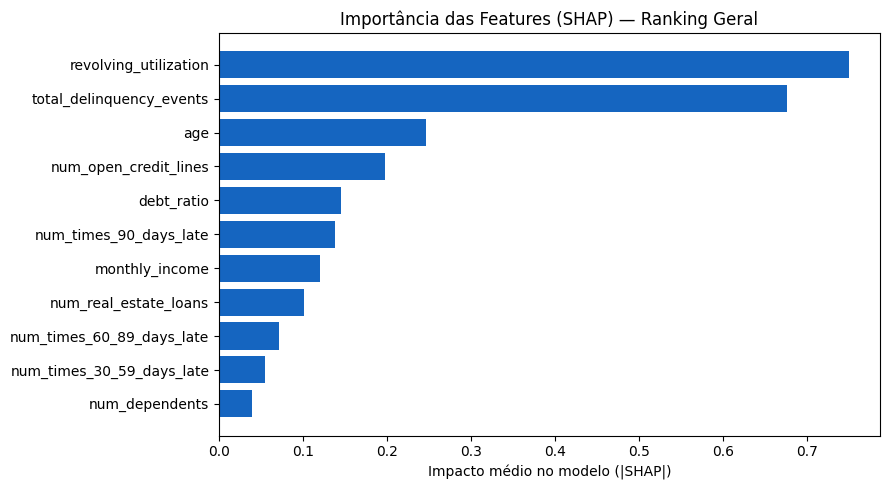
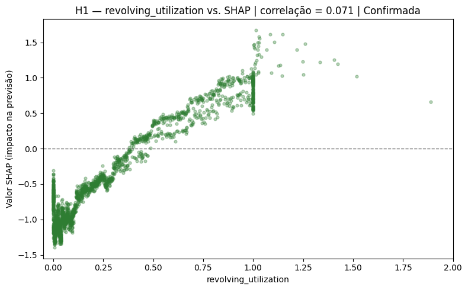
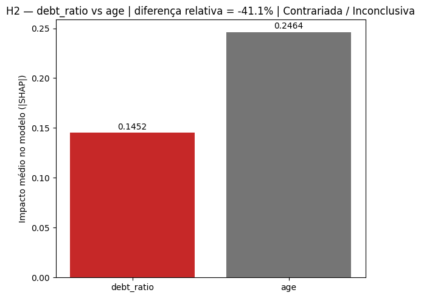
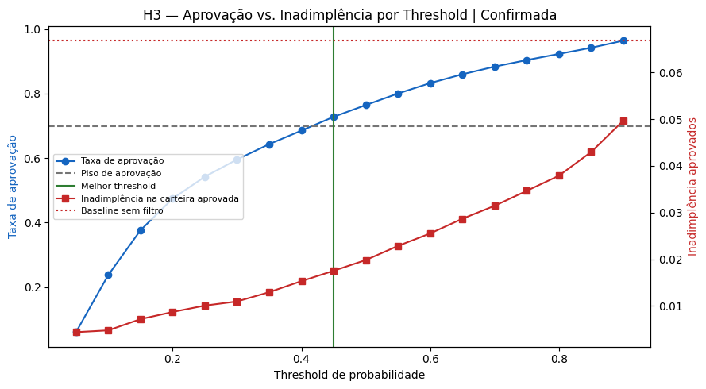
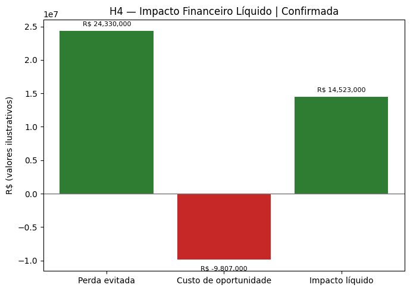

# Validação das Hipóteses H1–H4 — Modelo de Risco de Crédito

Os cinco gráficos do notebook `01_hipoteses_h1_h4` respondem, em sequência, a quatro perguntas de negócio sobre o modelo de risco de crédito. Abaixo, cada um explicado como se estivéssemos apresentando para o CEO.

---

## Gráfico 0 — Importância das variáveis (ranking SHAP)

**O que mostra:** cada barra é uma característica do cliente, e o tamanho da barra mede o quanto ela pesa, em média, na decisão do modelo. Pense no modelo como um analista de crédito: o SHAP mostra em quais informações da ficha ele mais presta atenção.

**O que demonstra:** duas variáveis dominam com folga.

- **Uso do crédito rotativo** (quanto do limite do cartão/cheque especial o cliente está usando): 0,75.
- **Histórico de atrasos** (total de eventos de inadimplência): 0,68.

Depois vem um degrau grande: idade (0,25), número de linhas de crédito abertas (0,20) e dívida/renda (0,15). O modelo principal (XGBoost) acerta bem: ROC-AUC de 0,867, contra 0,788 da regressão logística tradicional.

**Conclusão para o CEO:** o risco de um cliente é explicado principalmente pelo **comportamento** (como ele usa o crédito e se já atrasou), e não pelo perfil (renda, dependentes, imóveis). Na prática, se a empresa só pudesse coletar duas informações, seriam essas duas.

> **Observação técnica:** os atrasos de 30–59, 60–89 e 90+ dias aparecem lá embaixo provavelmente porque já estão somados dentro de `total_delinquency_events`. A informação não é irrelevante, ela está concentrada na variável agregada.

---

## Gráfico H1 — Uso do rotativo vs. impacto no risco

**O que mostra:** cada ponto é um cliente. O eixo horizontal é quanto do limite ele usa (0 = nada, 1,0 = limite estourado). O eixo vertical é o quanto isso **empurra o risco para cima** (acima da linha tracejada) ou **para baixo** (abaixo dela).

**O que demonstra:** a relação é praticamente uma escada subindo.

- Quem usa perto de 0% do limite tem o risco reduzido.
- Por volta de **35–40% de uso**, a variável deixa de ajudar e passa a prejudicar.
- Perto de **100% (limite estourado)** o risco dispara. É aquela coluna vertical de pontos em 1,0.

**Conclusão para o CEO:** a hipótese está **confirmada**. Cliente com o limite no talo é sinal de aperto financeiro, e esse é o alerta mais forte que o modelo tem. Isso pode virar regra operacional: monitorar clientes da carteira que cruzam ~40% e ~90% de uso.

> **Atenção:** o título mostra "correlação = 0,071", um número que parece dizer que a relação é fraca, mas o gráfico mostra o oposto. Isso acontece porque a correlação de Pearson é distorcida por outliers extremos (esse dataset tem clientes com utilização na casa dos milhares, cortados do gráfico pelo `xlim` em 2,0). Vale trocar por correlação de Spearman, ou calcular só no intervalo 0–1. Do jeito que está, o número enfraquece uma conclusão que é visualmente forte.

---

## Gráfico H2 — Dívida/renda vs. idade

**O que mostra:** compara o peso de duas variáveis no modelo: dívida/renda (vermelho, 0,145) e idade (cinza, 0,246).

**O que demonstra:** a hipótese era que dívida/renda seria um preditor mais forte que idade. Deu o contrário: **idade pesa 41% a mais**. Status: **contrariada**.

**Conclusão para o CEO:** o indicador clássico de "quanto da renda está comprometida" é menos útil do que se esperava. Há duas leituras:

1. **Negócio:** vale mais olhar **como** o cliente usa o crédito (H1) do que o índice de endividamento declarado. Renda autodeclarada costuma ser pouco confiável, o que ajuda a explicar isso.
2. **Risco regulatório:** o modelo apoiar-se tanto em idade merece cuidado, porque pode gerar tratamento desigual por faixa etária. O notebook 02 (viés por idade/renda) é justamente onde isso deve ser verificado antes de qualquer uso real.

---

## Gráfico H3 — Aprovação vs. inadimplência por threshold

**O que mostra:** o "threshold" é a régua de corte. O modelo dá a cada cliente uma nota de risco de 0 a 1, e quem fica acima da régua é recusado. O gráfico testa várias réguas ao mesmo tempo:

- **Linha azul:** % de clientes aprovados (eixo esquerdo).
- **Linha vermelha:** % de inadimplentes **entre os aprovados** (eixo direito).
- **Tracejado cinza:** piso mínimo de aprovação exigido pelo negócio (70%).
- **Pontilhado vermelho:** inadimplência atual, sem modelo (6,68%).
- **Linha verde:** régua escolhida.

**O que demonstra:** existe um dilema. Régua baixa (mais rigorosa) significa carteira limpa, mas quase ninguém aprovado. Régua alta (mais permissiva) significa muita gente aprovada, mas com mais calote. O melhor ponto que respeita o piso de 70% é **0,45**:

| | Sem modelo | Com modelo (régua 0,45) |
|---|---|---|
| Taxa de aprovação | 100% | 72,8% |
| Inadimplência da carteira | 6,68% | **1,75%** |

**Conclusão para o CEO:** hipótese **confirmada**. Recusando cerca de 27% dos pedidos, a inadimplência da carteira cai **cerca de 74%** (de 6,68% para 1,75%). Além disso, a régua é um **botão de estratégia**: se a empresa quiser crescer mais, sobe a régua e aceita um pouco mais de risco; se quiser proteger caixa, desce. O gráfico mostra exatamente o preço de cada escolha.

---

## Gráfico H4 — Impacto financeiro líquido

**O que mostra:** traduz a régua de H3 em reais.

- **Verde (perda evitada):** R$ 24,3 mi. São 1.622 maus pagadores recusados, a cerca de R$ 15 mil de perda cada.
- **Vermelho (custo de oportunidade):** –R$ 9,8 mi. São 6.538 bons pagadores recusados por engano, a cerca de R$ 1,5 mil de margem perdida cada.
- **Verde (impacto líquido):** **+R$ 14,5 mi**.

**O que demonstra:** o modelo erra bastante nas recusas. De cada 5 clientes recusados, só 1 era de fato mau pagador. Mesmo assim compensa, porque **um calote custa cerca de 10 vezes mais do que a margem de um bom cliente**. Evitar 1 calote paga 10 bons clientes perdidos.

**Conclusão para o CEO:** hipótese **confirmada**. O modelo gera valor líquido positivo mesmo sendo conservador. Porém, os valores de perda e margem são **ilustrativos** (vêm de `business_params.py`). O número de R$ 14,5 mi só vira argumento de investimento depois de substituído por dados financeiros reais da Mezzo. Se a proporção real entre perda e margem for bem menor que 10:1, o resultado pode encolher bastante.

---

## Resumo em uma frase por hipótese

| Hipótese | Conclusão | Status |
|---|---|---|
| H1 | O uso do limite é o principal alarme de risco | ✅ Confirmada |
| H2 | Dívida/renda importa menos que o esperado; o peso da idade precisa de checagem de viés | ❌ Contrariada |
| H3 | Dá para cortar a inadimplência em ~74% aprovando ~73% dos pedidos | ✅ Confirmada |
| H4 | O modelo se paga, com ressalva de que os valores em reais ainda são simulados | ✅ Confirmada |
