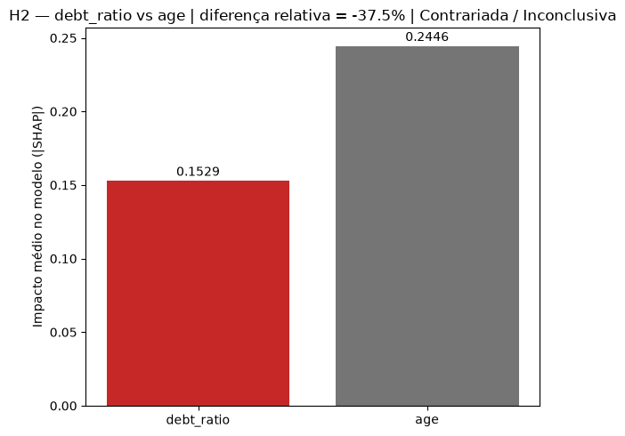
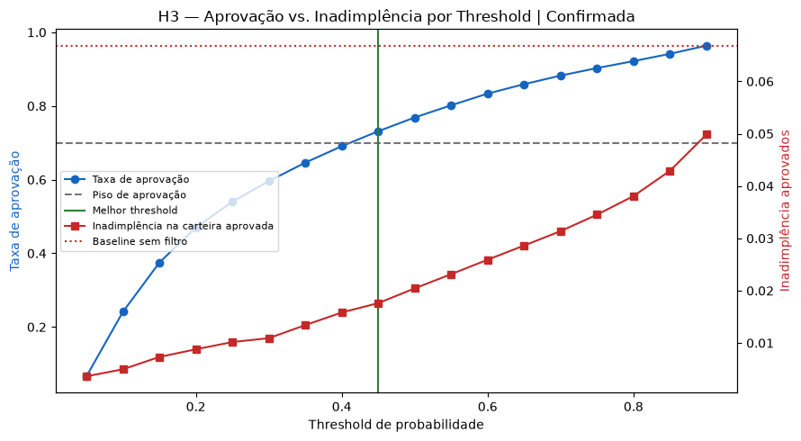
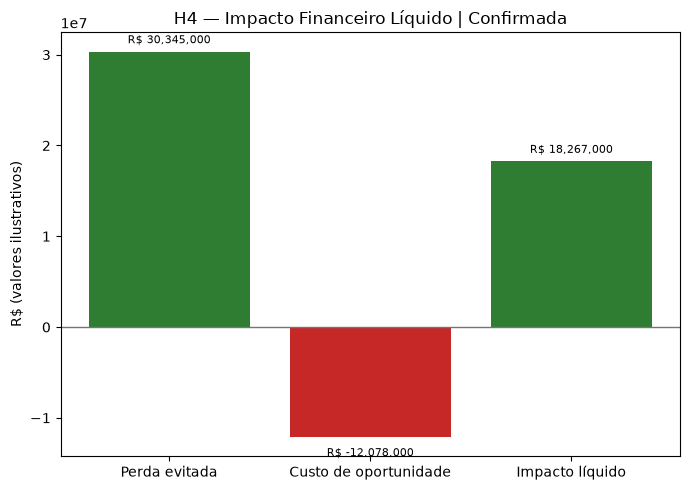
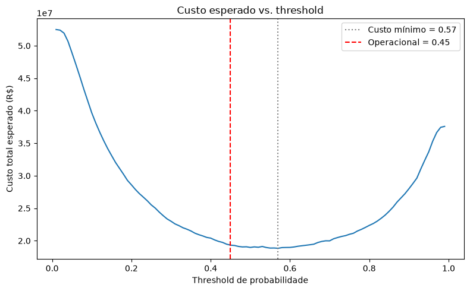
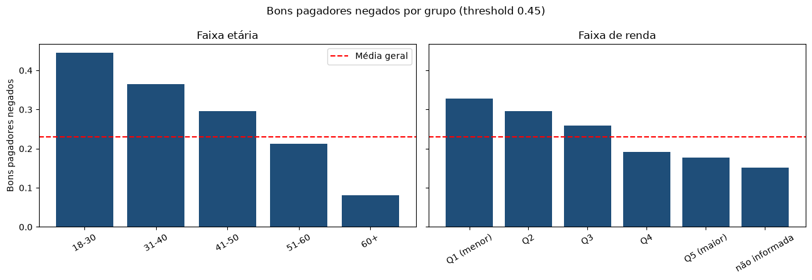
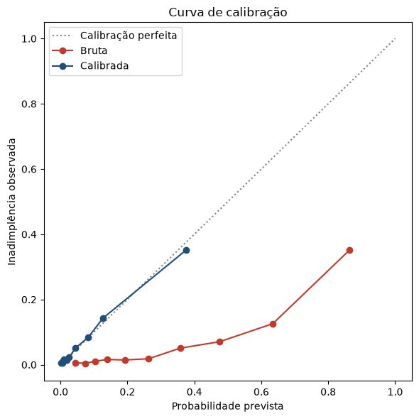
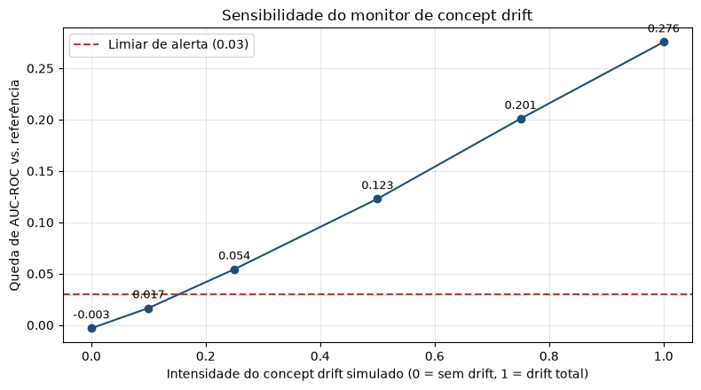

# Risco de Crédito — Score de Probabilidade de Inadimplência

*Parte da série **Databricks de Ponta a Ponta***

 

> Projeto de estudo com dados públicos (Kaggle *Give Me Some Credit*). Valores financeiros são ilustrativos e não representam dados de nenhuma instituição real.

## Resumo executivo

| Indicador | Resultado |
|---|---|
| ROC-AUC do modelo principal (XGBoost) | **0,866** (meta ≥ 0,85) — regressão logística: 0,790 |
| Régua de corte (threshold operacional) | **0,45**, a menor inadimplência com pelo menos 70% de aprovação |
| Taxa de aprovação | 100% → **73,1%** |
| Inadimplência da carteira aprovada | 6,68% → **1,76%** (queda de ~74%) |
| Ganho sobre a regressão logística, na mesma aprovação | inadimplência da carteira de **3,08% → 1,76%** |
| Impacto financeiro | o modelo se paga enquanto um calote custar mais de **4,0x** a margem de um bom cliente (+R$ 18,3 mi com os parâmetros ilustrativos) |
| Viés por idade | um bom pagador de 18–30 anos é recusado **5,4x** mais que um de 60+ (44,5% contra 8,2%) |
| Calibração | o score bruto prevê 31,5% de inadimplência média para 6,7% observada; calibrado, 6,7% |
| Monitoramento | data drift sobre 101.503 clientes de scoring: 11 de 11 features estáveis. Concept drift: sem falso alarme sem mudança e alerta a partir de 25% de intensidade |

**Em uma frase:** o risco é explicado principalmente pelo **comportamento** do cliente (uso do limite e histórico de atrasos), e um corte em 0,45 reduz a inadimplência em ~74% mantendo 73% de aprovação; mas o modelo distribui seus erros de forma desigual entre faixas etárias, e o score precisa ser calibrado antes de ser usado para precificar.

**Um modelo só.** Todos os números deste README vêm do mesmo modelo, o `@champion` (versão 1) registrado no Unity Catalog, avaliado no mesmo conjunto de teste de 37.500 clientes. Os notebooks de validação reproduzem o split de treino e confirmam que ele não mudou: a AUC recalculada precisa ser idêntica à registrada no run de treino, senão a execução é interrompida.

> **Nota metodológica:** essa checagem foi adicionada depois que, durante o desenvolvimento, dois notebooks chegaram a usar versões diferentes do modelo sem que isso aparecesse olhando só a AUC — os números pareciam coerentes, mas vinham de execuções diferentes. A validação do split resolve isso: se o modelo avaliado não for exatamente o `@champion` do run de treino, a execução para.

## Problema de negócio
Uma instituição financeira precisa decidir, para cada solicitação de crédito, se aprova ou não a operação — e com qual taxa de juros. A decisão precisa ser rápida, consistente entre analistas e defensável em auditoria. O objetivo deste projeto é construir um score de probabilidade de inadimplência que sustente essa decisão de ponta a ponta: da ingestão do dado até a pontuação de clientes novos, com monitoramento.

## Base de dados
- **Give Me Some Credit** (Kaggle) — https://www.kaggle.com/c/GiveMeSomeCredit — `cs-training.csv` com 150.000 clientes pessoa física, 10 variáveis explicativas e a variável-alvo `SeriousDlqin2yrs` (1 = inadimplência em 90+ dias nos próximos 2 anos); `cs-test.csv` com 101.503 clientes sem rótulo, usado como lote de produção
- **SCR.data** (BACEN, dados agregados) — https://dadosabertos.bcb.gov.br/dataset/scr_data — referência externa para comparar a taxa de inadimplência do modelo com a média nacional por segmento, não como dado de treino

## Métrica-alvo
- **Métrica primária:** AUC-ROC ≥ 0,85 no conjunto de teste (referência de mercado: soluções de topo da competição original atingem ~0,86–0,87) — **atingida: 0,866**
- **Métricas complementares:** KS-statistic (separação entre bons e maus pagadores) e recall na classe inadimplente a um nível de precisão definido pelo negócio
- **Métrica de negócio:** redução de inadimplência e impacto em R$ da política "com modelo" contra "aprovar todos" e contra a regressão logística na mesma taxa de aprovação

## Hipóteses

As quatro hipóteses seguem uma progressão em duas camadas. Não faz sentido decidir threshold ou calcular impacto em R$ (Camada 2) de um modelo em que ainda não se confia (Camada 1).

- **Camada 1 — Confiança no modelo (H1 e H2):** o modelo aprende algo que faz sentido de negócio, ou acerta por motivos que ninguém consegue explicar?
- **Camada 2 — Decisão operacional (H3 e H4):** dado que o modelo é confiável, que corte usar e se vale a pena financeiramente.

| Hipótese | Enunciado | Como foi testada | Decisão que sustenta |
|---|---|---|---|
| **H1** — Utilização do rotativo | Clientes com maior `revolving_utilization` têm probabilidade significativamente maior de inadimplência, porque uso próximo do limite indica menor folga financeira | Correlação de Spearman entre o valor da feature e seu próprio SHAP value (critério: > 0,05) | Confiar ou não no modelo |
| **H2** — Dívida/renda como preditor dominante | `debt_ratio` tem poder preditivo maior que `age` — capacidade de pagamento pesa mais que perfil demográfico | Comparação do \|SHAP\| médio entre `debt_ratio` e `age`, com margem relativa mínima de 10% | Aprovar o modelo em compliance/auditoria |
| **H3** — Threshold ótimo | Existe um ponto de corte que reduz a inadimplência da carteira aprovada sem derrubar a aprovação abaixo de um piso viável | Varredura de thresholds, filtrando pelo piso de aprovação (70%, ilustrativo) e escolhendo o de menor inadimplência entre os viáveis | Definir a regra operacional de aprovação |
| **H4** — Impacto financeiro | O modelo evita mais perdas em R$ do que o custo de rejeitar bons pagadores | Perda evitada (maus recusados × custo médio de inadimplência) vs. custo de oportunidade (bons recusados × margem média), no threshold de H3 | Aprovar (ou não) o investimento em produção |

## Resultados das hipóteses

Gráficos gerados no notebook `01_hipoteses_h1_h4`.

### Importância das variáveis (ranking SHAP)

Duas variáveis dominam, praticamente empatadas: **uso do crédito rotativo** (|SHAP| médio 0,72) e **total de eventos de atraso** (0,72). Depois vem um degrau grande: idade (0,24), número de linhas de crédito abertas (0,19), renda (0,16) e dívida/renda (0,15).

**Leitura:** o risco é explicado principalmente pelo comportamento (como o cliente usa o crédito e se já atrasou), e não pelo perfil (renda, dependentes, imóveis).

> Os atrasos de 30–59, 60–89 e 90+ dias aparecem no fim do ranking provavelmente porque já estão somados em `total_delinquency_events`. A informação não é irrelevante: está concentrada na variável agregada.

### H1 — Uso do rotativo vs. impacto no risco ✅ Confirmada

Cada ponto é um cliente: eixo horizontal = fração do limite utilizada; eixo vertical = contribuição SHAP para o risco. A relação é uma escada subindo, com **correlação de Spearman de 0,879**: uso perto de 0% reduz o risco, por volta de **35–40%** a variável passa a prejudicar e perto de **100% (limite estourado)** o risco dispara.

**Implicação:** o uso do limite é um dos dois alertas mais fortes do modelo e pode virar regra operacional — monitorar clientes da carteira que cruzam ~40% e ~90% de uso.

> **Nota metodológica:** a primeira versão do teste usava a correlação de Pearson, que é distorcida pelos outliers extremos de utilização (clientes com valores na casa dos milhares, cortados do gráfico). O resultado oscilava em torno do próprio critério: 0,071 numa execução, 0,047 em outra, com a H1 passando e falhando sem nenhuma mudança real. A limitação já estava documentada antes da troca. A Spearman mede a relação crescente pela ordenação dos valores e não é afetada pelos outliers; um teste unitário (`tests/test_hypothesis_validation.py`) reproduz o problema e garante que ele não volte.

### H2 — Dívida/renda vs. idade ❌ Contrariada

A hipótese era que dívida/renda superaria idade. Deu o contrário: o |SHAP| médio de dívida/renda (0,153) fica **37% abaixo** do de idade (0,245); a idade pesa cerca de 1,6 vez mais.

**Implicações:**
1. **Negócio:** vale mais olhar *como* o cliente usa o crédito (H1) do que o índice de endividamento declarado — renda autodeclarada costuma ser pouco confiável.
2. **Risco regulatório:** o peso da idade pode gerar tratamento desigual por faixa etária. A análise de viés abaixo confirma que isso acontece.

### H3 — Aprovação vs. inadimplência por threshold ✅ Confirmada

| | Sem modelo | Com modelo (threshold 0,45) |
|---|---|---|
| Taxa de aprovação | 100% | 73,1% |
| Inadimplência da carteira | 6,68% | **1,76%** |

**Implicação:** recusando ~27% dos pedidos, a inadimplência cai ~74%. O threshold funciona como botão de estratégia: subir a régua favorece crescimento com mais risco; descer protege caixa.

> O 0,45 é uma nota do modelo, não uma probabilidade de 45%: o score bruto é descalibrado (ver calibração abaixo). A ordenação dos clientes, e portanto a decisão, não depende disso.

### H4 — Impacto financeiro líquido ✅ Confirmada

| Componente | Cálculo | Valor |
|---|---|---|
| Perda evitada | 2.023 maus pagadores recusados × R$ 15 mil | +R$ 30,3 mi |
| Custo de oportunidade | 8.052 bons pagadores recusados × R$ 1,5 mil | –R$ 12,1 mi |
| **Impacto líquido** | | **+R$ 18,3 mi** |

**Implicação:** de cada 5 clientes recusados, só 1 era de fato mau pagador. Mesmo assim o modelo compensa, porque um calote custa ~10 vezes a margem de um bom cliente.

**Ponto de equilíbrio:** o modelo se paga sempre que a perda por calote for maior que **4,0 vezes** a margem de um bom cliente (8.052 ÷ 2.023). Essa conclusão não depende dos valores ilustrativos de `business_params.py`: o negócio pode checá-la com os próprios números de perda e margem.

### Resumo por hipótese

| Hipótese | Conclusão | Status |
|---|---|---|
| H1 | O uso do limite é um dos dois principais alarmes de risco (Spearman 0,879) | ✅ Confirmada |
| H2 | Dívida/renda importa menos que idade; o peso da idade gera viés mensurável | ❌ Contrariada |
| H3 | Dá para cortar a inadimplência em ~74% aprovando ~73% dos pedidos | ✅ Confirmada |
| H4 | O modelo se paga enquanto um calote custar mais de 4x a margem de um bom cliente | ✅ Confirmada |

## Viés, calibração e comparação

Gráficos e tabelas do notebook `02_vies_threshold_roi`, no mesmo modelo, teste e threshold operacional das hipóteses.

### Threshold de custo mínimo vs. operacional

Minimizando só o custo esperado, o melhor corte seria **0,57**, com 81,5% de aprovação. O threshold operacional (0,45) aprova menos e custa **R$ 484,5 mil a mais** no teste. Esse é o preço da restrição escolhida em H3, e a decisão entre os dois é de negócio: 0,45 prioriza inadimplência baixa na carteira; 0,57, o menor custo total.

### Viés por idade e renda

| Faixa etária | Clientes | Inadimplência real | Aprovação | Bons pagadores negados (IC 95%) |
|---|---|---|---|---|
| 18–30 | 2.676 | 12,0% | 50,1% | **44,5%** (42,5–46,5%) |
| 31–40 | 5.985 | 9,5% | 58,9% | 36,5% (35,2–37,7%) |
| 41–50 | 8.745 | 8,5% | 65,8% | 29,6% (28,6–30,6%) |
| 51–60 | 8.931 | 6,3% | 75,3% | 21,2% (20,4–22,1%) |
| 60+ | 11.163 | 2,8% | 90,3% | **8,2%** (7,7–8,7%) |

Duas métricas guiam a leitura:

- **Razão de aprovação (regra dos 4/5):** as faixas de 18 a 50 anos ficam abaixo de 0,80 da aprovação da faixa 60+. Parte disso reflete risco real: a inadimplência dos jovens é mais de 4 vezes maior.
- **Bons pagadores negados:** mede quem paga pelo erro do modelo. Um **bom pagador de 18–30 anos tem 5,4 vezes mais chance de ser recusado** que um de 60+, com intervalos de confiança que não se sobrepõem. No sentido oposto, o modelo aprova 37% dos maus pagadores acima de 60 anos, contra 10% entre os jovens.

Na renda, o padrão é o mesmo, mais leve: 32,8% de bons pagadores negados no quintil de menor renda, contra 17,7% no maior. Os clientes que não informaram renda (~20% da base) formam um grupo próprio e são os mais aprovados (81,5%), com inadimplência real também baixa (5,4%).

**Por que isso não se resolve só com técnica.** Quando dois grupos têm taxas reais de inadimplência muito diferentes, nenhum score consegue ser ao mesmo tempo bem calibrado e ter a mesma taxa de bons pagadores negados nos dois grupos (Kleinberg et al., 2016; Chouldechova, 2017). Reduzir a diferença exige escolher qual critério de justiça priorizar, e esse critério precisa ser definido com as áreas de risco, jurídico e compliance antes de qualquer uso real do modelo.

### Calibração

| | Inadimplência média prevista | Brier | Erro médio de calibração |
|---|---|---|---|
| Score bruto | 31,5% | 0,141 | 0,248 |
| Calibrado (isotônica) | 6,7% | 0,050 | 0,007 |
| Observada | 6,7% | | |

O modelo foi treinado com `scale_pos_weight` para compensar o desbalanceamento, o que infla as probabilidades: ele prevê em média 31,5% de inadimplência para uma base com 6,7%. Para aprovar ou negar, isso não importa, porque só a ordenação conta. **Para precificar juros por risco, só o score calibrado serve.** A calibração isotônica foi ajustada em metade do teste e avaliada na outra metade; por ser monotônica, não muda a ordenação dos clientes.

### XGBoost vs. regressão logística na mesma taxa de aprovação

| Modelo | AUC | Inadimplência da carteira aprovada | Maus recusados | Bons recusados |
|---|---|---|---|---|
| XGBoost (`@champion`) | 0,866 | **1,76%** | 2.023 | 8.052 |
| Regressão logística | 0,790 | 3,08% | 1.662 | 8.413 |

Aprovando os mesmos 73,1% dos pedidos, o XGBoost recusa **361 maus pagadores a mais** e **361 bons pagadores a menos**, e a inadimplência da carteira cai de 3,08% para 1,76%. É a comparação que interessa ao negócio: não contra "aprovar todo mundo", política que nenhuma instituição usa, mas contra um modelo mais simples e mais fácil de explicar.

## Perguntas de investigação
1. **Quais variáveis têm maior poder preditivo?** → ranking SHAP, H1 e H2.
2. **Existe um threshold que equilibra aprovação e inadimplência?** → H3 (0,45) e a comparação com o threshold de custo mínimo (0,57).
3. **O modelo trata faixas de renda e idade de forma equivalente?** → não: bons pagadores jovens e de menor renda são recusados com frequência bem maior (seção de viés).
4. **Qual o impacto financeiro estimado?** → H4: ponto de equilíbrio de 4,0x (+R$ 18,3 mi com os parâmetros ilustrativos).

## Modelo
- **Modelo principal:** XGBoost — dado tabular, alvo binário desbalanceado (6,68% de positivos) e interações não lineares entre variáveis financeiras. Registrado no Unity Catalog como `credito_risco_xgb`, versão 1, alias `@champion`
- **Baseline interpretável:** regressão logística com imputação pela mediana, padronização e `class_weight="balanced"` (AUC 0,790)
- **Desbalanceamento:** `scale_pos_weight` no XGBoost e `class_weight="balanced"` na logística. Efeito colateral documentado: probabilidades infladas, corrigidas pela calibração
- **Explicabilidade:** SHAP no modelo principal — cada decisão pode ser rastreada até as variáveis que mais pesaram
- **Split único e verificado:** 25% de teste, seed 42, estratificado, definido em `src/models/hypothesis_validation.py` e usado pelos dois notebooks de validação

## Arquitetura no Databricks (pipeline ponta a ponta)
1. **Bronze** — ingestão incremental via Auto Loader, com tabelas separadas para treino (`cs-training.csv`) e scoring (`cs-test.csv`)
2. **Silver** — padronização de nomes e tipos e regras de qualidade por quarentena lógica (idade fora de 18–120 e códigos de erro nos atrasos são marcados, não descartados), com MERGE idempotente
3. **Gold** — modelo estrela (`dim_customer` + `fct_credit_profile`) com treino e scoring na mesma tabela (alvo nulo = lote novo), deslocamento de IDs do scoring e checagem de unicidade
4. **Treino e registro** — XGBoost registrado no Unity Catalog com a AUC de teste logada no MLflow; o alias `@champion` aponta para a versão em produção
5. **Validação** — hipóteses, viés, calibração e comparação com a logística no `@champion`, com checagem de que o split de teste é o mesmo do treino
6. **Produção** — inferência batch (`03_inferencia_batch.py`) pontuando o lote de scoring (101.503 clientes) com o threshold operacional
7. **Monitoramento** — data drift e concept drift, com métricas no MLflow e histórico em tabelas Delta (detalhes abaixo)
8. **Governança** — Unity Catalog controlando acesso às tabelas e ao modelo registrado

## Monitoramento pós-deploy

O monitoramento responde a duas perguntas diferentes, tratadas em notebooks separados em `notebooks/monitoracao/`. A lógica de cálculo fica em `src/monitoring/`, em numpy/pandas puro, e é coberta por testes unitários (`tests/test_data_drift.py`, `tests/test_concept_drift.py` e `tests/test_concept_drift_intensidade.py`) que rodam sem cluster.

| | Data drift | Concept drift |
|---|---|---|
| **Pergunta** | Os dados que estão chegando parecem com os dados de treino? | O modelo continua acertando, mesmo que os dados pareçam iguais? |
| **Notebook** | `01_drift_dados.py` | `02_concept_drift.py` |
| **Comparação** | Base de treino (Gold com rótulo) vs. lote de scoring (Gold sem rótulo) | AUC-ROC de referência vs. AUC-ROC do lote avaliado, usando o `@champion` |
| **Métricas** | PSI por feature (bins pelos decis da referência) + KS como segunda leitura | Queda absoluta de AUC-ROC + KS do lote atual |
| **Limiares** | PSI < 0,10 estável · 0,10–0,25 moderado · ≥ 0,25 severo | Alerta quando a AUC cai 0,03 ou mais |
| **Saída** | `ml.monitoramento_drift_dados` + experimento MLflow | `ml.monitoramento_concept_drift` + experimento MLflow |

Os limiares são pontos de partida documentados e devem ser calibrados com a área de risco.

**Lote de scoring sem *training-serving skew*.** O `cs-test.csv` do Kaggle (clientes sem rótulo) entra como lote de produção e percorre o mesmo pipeline do treino. As regras da Silver são fixas (faixa de idade, códigos de erro nos atrasos, dependentes nulos), sem parâmetros calculados a partir dos dados, então o scoring recebe exatamente o mesmo tratamento. Na Gold, como os dois arquivos numeram clientes a partir de 1, os IDs do scoring recebem um deslocamento antes da união, e um teste de unicidade impede que a dimensão de clientes descarte registros em silêncio.

> **Nota metodológica:** antes do deslocamento, os IDs de treino e de scoring colidiam em silêncio — um cliente de treino e um de scoring com o mesmo ID viravam um só registro na dimensão, trocando a idade (e demais atributos) entre as duas populações sem gerar nenhum erro. Isso afetava os cerca de 101 mil clientes do lote de scoring. O teste de unicidade garante que a dimensão final tenha exatamente 251.503 clientes, sem colisão.

### Resultado do data drift

Referência: 150.000 clientes de treino. Lote avaliado: 101.503 clientes de scoring. A Gold ficou com 251.503 registros, sem IDs duplicados, e o resultado foi registrado no experimento MLflow `/Shared/credito_risco_monitoramento` e persistido em `credito_dev.ml.monitoramento_drift_dados`, que acumula o histórico a cada execução.

| Feature | PSI | KS | Classificação |
|---|---|---|---|
| monthly_income | 0,00039 | 0,0044 | estável |
| revolving_utilization | 0,00012 | 0,0031 | estável |
| debt_ratio | 0,00011 | 0,0036 | estável |
| num_open_credit_lines | 0,00011 | 0,0013 | estável |
| num_real_estate_loans | 0,00005 | 0,0029 | estável |
| total_delinquency_events | 0,00002 | 0,0018 | estável |
| age | 0,00001 | 0,0012 | estável |
| num_times_30_59_days_late | 0,00001 | 0,0010 | estável |
| num_dependents | < 0,00001 | 0,0005 | estável |
| num_times_60_89_days_late | 0* | 0,0003 | estável |
| num_times_90_days_late | 0* | 0,0007 | estável |

**Leitura:** nenhuma feature se aproxima do limiar de 0,10. É o resultado esperado, porque o Kaggle separou treino e teste aleatoriamente a partir da mesma população. A execução funciona como teste de falso alarme: o monitoramento não dispara quando não há mudança.

\* **Limitação identificada:** nas duas features de atraso com quase todos os valores iguais a zero, os decis da referência colapsam e a função de PSI retorna 0 por construção, sem medir de fato. Neste lote o KS confirma que não há drift, mas um drift real nessas variáveis passaria despercebido pelo PSI. A correção (bins por valor distinto) está nos próximos passos.

**Por que o concept drift roda em modo simulado.** O alvo tem horizonte de 24 meses: o resultado real de um cliente pontuado hoje só é conhecido cerca de dois anos depois. Sem esses rótulos atrasados, não há como medir a performance real em produção. O notebook foi preparado para os dois cenários:

- **Modo real:** lê uma tabela de resultados realizados (`gold.resultados_realizados`) e compara com a AUC registrada como tag na versão do modelo. Essa tabela ainda não existe; quando ela não é encontrada, o notebook cai automaticamente para simulação.
- **Modo simulado:** gera lotes sintéticos em que os sinais comportamentais que o modelo mais usa (utilização do limite e histórico de atrasos) perdem força na relação com o alvo, com intensidade graduável de 0 (sem drift) a 1 (drift total). As features são idênticas em qualquer intensidade e a taxa de inadimplência fica fixa em 6,68%, o que isola a mudança em P(alvo | features). O valor absoluto da AUC sintética não é comparável ao do treino; o que importa é a queda relativa.

### Resultado do concept drift (simulação)

O `@champion` (versão 1) foi avaliado em uma referência sintética sem drift (AUC-ROC 0,809) e em seis lotes com intensidades crescentes de drift, 20.000 clientes cada.

| Intensidade | AUC-ROC do lote | Queda | Alerta |
|---|---|---|---|
| 0,00 | 0,812 | –0,003 | não |
| 0,10 | 0,792 | 0,017 | não |
| 0,25 | 0,754 | 0,054 | **sim** |
| 0,50 | 0,686 | 0,123 | sim |
| 0,75 | 0,608 | 0,201 | sim |
| 1,00 | 0,533 | 0,276 | sim |

**Leitura:** o monitor não dispara quando a relação entre features e alvo não muda (intensidade 0) e passa a disparar a partir de 25% de intensidade. Drifts mais sutis, na faixa de 10%, ficam abaixo do limiar de 0,03; se a área de risco precisar detectá-los, o limiar pode ser reduzido, ao custo de mais alarmes falsos. Somado ao data drift, o monitoramento foi validado nos dois sentidos: não alarma sem mudança e alarma quando ela acontece.

**Uma primeira versão da simulação não disparou o alerta.** Ela enfraquecia `debt_ratio`, variável fraca no modelo real, e gerava quase toda a utilização abaixo de 40%, faixa em que o modelo praticamente não reage. A queda de AUC foi de apenas 0,015. O gerador foi refeito para atuar nos sinais que o modelo de fato usa, e o comportamento do gerador passou a ser coberto por testes unitários (`tests/test_concept_drift_intensidade.py`).

## Limitações assumidas
- O dado é de 2011 e de clientes americanos — usado como base metodológica, não como fonte de verdade sobre o mercado brasileiro; o cruzamento com o SCR.data contextualiza essa diferença, não a corrige
- A variável-alvo tem 24 meses de horizonte; decisões de crédito com prazo diferente exigiriam reavaliação do problema
- Custo de inadimplência, margem e piso de aprovação são parâmetros ilustrativos; o ponto de equilíbrio (4,0x) é a conclusão que não depende deles
- O modelo distribui erros de forma desigual por idade e renda (seção de viés); nenhum uso em decisão real antes de um critério de justiça definido com risco, jurídico e compliance
- O score bruto não é uma probabilidade; qualquer uso para precificação exige a versão calibrada
- O concept drift só pode ser medido de verdade com rótulos realizados, que chegam com cerca de 24 meses de atraso; até lá, o monitoramento de performance é validado apenas em simulação e o data drift funciona como alerta antecipado

## Próximos passos
- [ ] Treinar uma versão sem a variável idade e medir o trade-off entre AUC e taxa de bons pagadores negados por faixa (variáveis como número de linhas de crédito podem carregar informação de idade indiretamente)
- [ ] Definir, com risco, jurídico e compliance, o critério de justiça aceitável e avaliar thresholds por segmento
- [ ] Registrar o calibrador junto com o modelo e gravar a probabilidade calibrada na inferência batch
- [ ] Centralizar o threshold operacional em `src/config/business_params.py`, usado pela validação e pela inferência
- [ ] Tratar features de contagem com muitos zeros no cálculo do PSI (bins por valor distinto em vez de decis) — limitação confirmada na execução real
- [ ] Criar a tabela `resultados_realizados` para ativar o modo real do concept drift
- [ ] Investigar a concentração de valores repetidos em `monthly_income` na camada Silver
- [ ] Avaliar Model Serving para scoring em tempo real, complementando a inferência batch

## Status
Ingestão (treino e scoring), registro do `@champion`, validação das hipóteses, análise de viés, calibração, comparação com a logística, inferência batch e monitoramento (data drift e concept drift simulado) executados. Pendentes: mitigação do viés, calibração em produção e modo real do concept drift.
